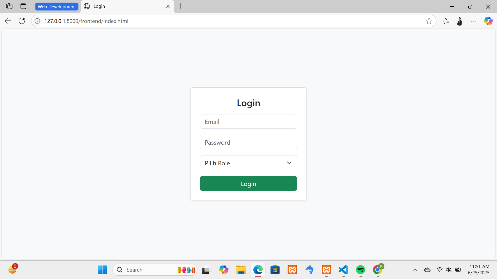
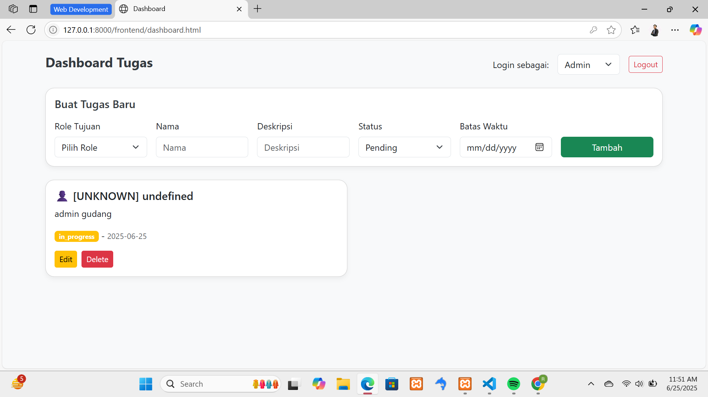

<p align="center">
  <a href="https://laravel.com" target="_blank">
    
  </a>
</p>

<p align="center">
  <b>User & Task Management API</b><br>
  RESTful API project built with Laravel 10 and Vanilla JS as part of Fullstack Developer test.
</p>

---

📷 Screenshot Tampilan
 || 

---

⚙️ Contoh File .env.example
APP_NAME=Laravel
APP_ENV=local
APP_KEY=
APP_DEBUG=true
APP_URL=http://localhost

LOG_CHANNEL=stack
LOG_DEPRECATIONS_CHANNEL=null
LOG_LEVEL=debug

DB_CONNECTION=mysql
DB_HOST=127.0.0.1
DB_PORT=3306
DB_DATABASE=laravel
DB_USERNAME=root
DB_PASSWORD=

---

## 📌 Deskripsi Proyek

Proyek ini merupakan sistem **Manajemen Tugas** dengan tampilan dashboard interaktif berbasis **Laravel 10 (Backend)** dan **Vanilla JavaScript + HTML + Bootstrap (Frontend)**. Sistem ini menerapkan fitur kontrol akses berbasis peran (role-based permission) untuk tiga jenis pengguna: **Admin**, **Manager**, dan **Staff**.

Karena adanya kendala dalam integrasi autentikasi token (Sanctum), sistem dibangun agar **tidak memerlukan proses login**. Pengguna cukup memilih peran dari dropdown dan sistem akan menyesuaikan hak akses secara otomatis di tampilan dashboard. Seluruh operasi CRUD (Create, Read, Update, Delete) langsung terhubung ke **TaskController Laravel**, tanpa menggunakan blade atau token API. Sistem tetap fungsional dan meniru alur kerja seperti aplikasi profesional dengan UI yang bersih dan responsif, dan sistem ini bisa dikembangkan lebih lanjut.

---

## ✅ Fitur Utama

* Dashboard interaktif dan responsif
* Kontrol akses berdasarkan peran pengguna (Admin, Manager, Staff)
* Input tugas dengan batas waktu & status
* Filter tampilan tugas sesuai peran
* Tombol **Edit** dan **Delete** muncul sesuai izin akses
* Logout simulasi
* Tanpa login cukup pilih role

---

## 🛠️ Langkah Instalasi

1. **Clone repositori**

   ```bash
   git clone https://github.com/ryanzuni/ryanzuni.git
   cd ryanzuni
   ```

2. **Install dependency Laravel**

   ```bash
   composer install
   ```

3. **Salin file konfigurasi .env dan generate key**

   ```bash
   cp .env.example .env
   php artisan key:generate
   ```

4. **Buat database dan sesuaikan pengaturan di `.env`**

   ```
   DB_DATABASE=tes_ryanzuni
   DB_USERNAME=root
   DB_PASSWORD=
   ```

5. **Jalankan migrasi**

   ```bash
   php artisan migrate atau php artisan migrate:fresh --seed
   ```

6. **Jalankan server Laravel**

   ```bash
   php artisan serve
   ```

7. **Buka dashboard**
   Akses file `public/frontend/dashboard.html` langsung via browser:

   ```
   http://localhost:8000/frontend/dashboard.html
   ```

---

## 🚪 Simulasi Login

Tidak menggunakan autentikasi token atau sesi. Simulasi login dilakukan dengan memilih peran dari dropdown **"Login sebagai:"** di halaman dashboard. Hak akses akan langsung menyesuaikan sesuai role yang dipilih.
Akses file `http://localhost:8000/frontend/index.html` langsung via browser:
   
**TERIMA KASIH, MOHON MAAF JIKA TIDAK SESUAI DAN SISTEM MASIH BANYAK KURANGNYA**